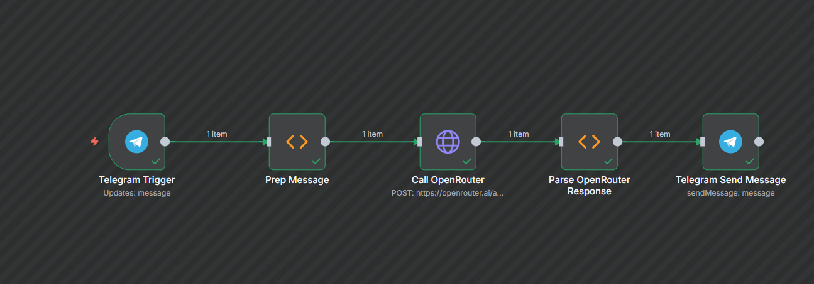

# AIBot n8n Workflow

A Telegram AI Chatbot built with n8n workflow automation that integrates with OpenRouter's Polaris Alpha model to provide intelligent responses.

> **📸 Image Placeholder**: Replace `./assets/workflow-diagram.png` with an actual screenshot of your n8n workflow showing the 5 connected nodes: Telegram Trigger → Prep Message → Call OpenRouter → Parse OpenRouter Response → Telegram Send Message

## 🚀 Features

- **Smart Message Processing**: Handles various message types and commands
- **AI-Powered Responses**: Uses OpenRouter's Polaris Alpha model
- **Code Formatting**: Properly formats code blocks for Telegram
- **Error Handling**: Graceful fallbacks for API failures
- **Rich Text Support**: MarkdownV2 formatting with proper escaping
- **Elegant UI**: Branded responses with clear structure

## 📋 Prerequisites

Before setting up this workflow, you'll need:

1. **n8n Instance** - Self-hosted or cloud
2. **Telegram Bot Token** - Create via [@BotFather](https://t.me/botfather)
3. **OpenRouter API Key** - Get from [OpenRouter](https://openrouter.ai/)

## 🛠️ Installation

### 1. Import Workflow
1. Copy the contents of `src/AIBot_Workflow.json`
2. In n8n, go to **Workflows** → **Import from File/URL**
3. Paste the JSON content and import

### 2. Configure Credentials

#### Telegram API
1. Go to **Credentials** → **Add Credential**
2. Select **Telegram API**
3. Enter your bot token from BotFather

#### OpenRouter API
1. Go to **Credentials** → **Add Credential**
2. Select **HTTP Header Auth**
3. Set header name: `Authorization`
4. Set header value: `Bearer YOUR_OPENROUTER_API_KEY`

### 3. Update Configuration
- Update the HTTP-Referer header in the "Call OpenRouter" node to match your n8n instance URL
- Activate the workflow

## 🔧 Configuration

### Bot Personality
The AI assistant is configured as "Polaris Alpha" with:
- Quick and reliable responses
- Polite and professional tone
- Clear and concise communication
- Temperature: 0.6 (balanced creativity)
- Max tokens: 512 (concise responses)

### Customization
You can modify the system prompt in the "Call OpenRouter" node to change the bot's personality and behavior.

## 📊 Workflow Structure

The workflow consists of 5 main nodes:

1. **Telegram Trigger** - Listens for incoming messages
2. **Prep Message** - Processes and formats input
3. **Call OpenRouter** - Makes API calls to AI service
4. **Parse OpenRouter Response** - Formats AI responses
5. **Telegram Send Message** - Sends formatted replies

## 🤖 Usage

1. Start a conversation with your bot on Telegram
2. Send `/start` to get a welcome message
3. Ask any question or request assistance
4. The bot will respond with AI-generated answers

## 📝 License

This project is licensed under the MIT License - see the [LICENSE](LICENSE) file for details.

## 👨‍💻 Author

**TAKSH ASHISH GANDHI** - 2025

## 🤝 Contributing

Contributions are welcome! Please feel free to submit a Pull Request.

## 📞 Support

If you encounter any issues or have questions, please open an issue in this repository.
